# BIN Projekt - Dokuemtnace

### 1. Načtení dat do Power BI

### 2. Změna datového typu v Power BI Query Editoru

| Tabulka   | Sloupec        | Změna               | Popis                                            |
| --------- | -------------- | ------------------- | ------------------------------------------------ |
| Lokality  | Kapacita       | Změna datového typu | Změna datového typu z "Text" na "Whole Number"   |
| Aktivity  | Cena           | Změna datového typu | Změna datového typu z "Text" na "Decimal Number" |
| Aktivity  | Trvani         | Změna datového typu | Změna datového typu z "Text" na "Whole Number"   |
| Aktivity  | Kapacita       | Změna datového typu | Změna datového typu z "Text" na "Whole Number"   |
| Rezervace | DatumRezervace | Změna datového typu | Změna datového typu z "Text" na "Date/Time"      |
| Rezervace | CasRezervace   | Změna datového typu | Změna datového typu z "Text" na "Time"           |
| Rezervace | Cena           | Změna datového typu | Změna datového typu z "Text" na "Decimal Number" |
| Zakaznici | Vek            | Změna datového typu | Změna datového typu z "Text" na "Whole Number"   |
| Zruseni   | DatumZruseni   | Změna datového typu | Změna datového typu z "Text" na "Date"           |

### 3. Datum rezervace ořezání čistě na datum
 
- Extract -> Text Before Delimiter -> Delimiter = " " -> Advanced Options -> From the end of the input, 0
- Změna datového typu z "Text" na "Date"

### 4. Vytvoření sloupce DatumCasRezervace

- Vybrání sloupce DatumRezervace a CasRezervace
- Vytvoření nového sloupce (Add Column -> Merge Columns)
- Separator = " " (space)
- Název nového sloupce DatumCasRezervace

### 5. Úprava sloupce "StatusVIP" v tabulce "Zakaznici"

- Provedení lowercase transformace z Ano -> ano a Ne -> ne
- Nahrazení hodnot "ano" na 1 a "ne" na 0
- Změna datového typu z "Text" na "True/False"

| Tabulka   | Sloupec   | Změna               | Popis                                        |
| --------- | --------- | ------------------- | -------------------------------------------- |
| Zakaznici | StatusVIP | Změna datového typu | Změna datového typu z "Text" na "True/False" |

### 6. Úprava sloupce "Pohlavi" v tabulce "Zakaznici"
- Převedení M a F na Uppercase pro lepší ošetření (kdyby se mezi novými daty objevily nějaké anomálie) a pak přejmenování z M na Muž a z F na Žena, pro lepší čitelnost a pochopení dat

### 7. Ošetření null hodnot v tabulce Rezervace

- ZakaznikID -> Replace Values -> null za Z0
- AktivitaID -> Replace Values -> null za A0
- LokalitaID -> Replace Values -> null za L0

### 8. V tabulce Aktivity nahrazení ve sloupci popis hodnoty "Plavání" za hodnotu "Plavání pro všechny úrovne."
- Replace values -> "Plavání" + Match entire cell contents -> "Plavání pro všechny úrovne."

### 9. V tabulce Rezervace se nachází aktivita s ID A178 a aktivita s tímto ID se nenachází v tabulce Aktivity
- Nahrazení aktivity A178 za A0 (neznámá aktivita)
- Replace Values -> "A178" + Match entire cell contents -> "A0"

### 10. V tabulce Rezervace se nachází lokalita s ID L80 a lokalita s tímto ID se nenachází v tabulce Lokality
- Nahrazení lokality L80 za L0 (neznámá lokalita)
- Replace Values -> "L80" + Match entire cell contents -> "L0"

### 11. Vytvoření tabulky Kalendar
| Tabulka  | DAX Kód                                                                                                                                                                                                                                                          |
| -------- | ---------------------------------------------------------------------------------------------------------------------------------------------------------------------------------------------------------------------------------------------------------------- |
| Kalendar | Kalendar = ADDCOLUMNS(CALENDAR(DATE(2021, 1, 1), DATE(2026, 12, 31)), "Rok", YEAR([Date]), "Čtvrtletí", "Q" & FORMAT([Date], "q"), "Měsíc č.", MONTH([Date]), "Měsíc", FORMAT([Date], "mmmm", "cs-CZ"), "Den", DAY([Date]), "Název dne", FORMAT([Date], "dddd")) |

### 12. Datový model
- **Typ modelu:** Hvězdicové schéma
- **Faktová tabulka:** Rezervace
- **Dimenzní tabulky:** Aktivity, Zakaznici, Lokality, Zruseni, Kalendar (vytvořená)
- **Relace**
  - **1:N** - Aktivity, Zakaznici, Lokality, Kalendar -> Rezervace
  - **1:1** - Zruseni <-> Rezervace

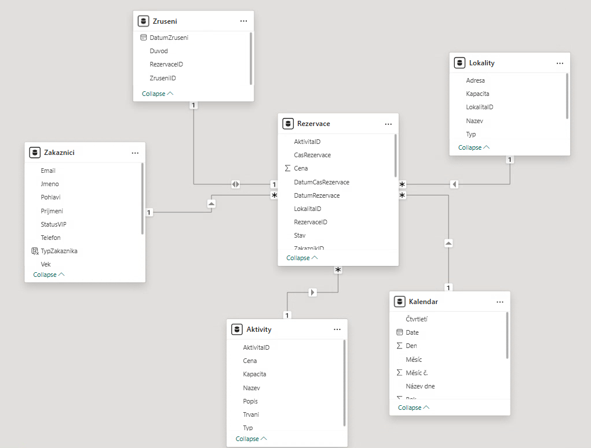

### 13. Popis vytvořených metrik
| Název metriky                                | DAX Kód                                                                                                                                                                                   | Popis logiky                                                                                                                                                                                                                                                               |
| -------------------------------------------- | ----------------------------------------------------------------------------------------------------------------------------------------------------------------------------------------- | -------------------------------------------------------------------------------------------------------------------------------------------------------------------------------------------------------------------------------------------------------------------------- |
| **Nejlepší lokalita**                        | NejlepsiLokalita = TOPN(1, VALUES(Lokality[Nazev]), CALCULATE(SUM(Rezervace[Cena])), DESC)                                                                                                | Pomocí funkce TOPN vybere jednu lokalitu (podle názvu), která má nejvyšší součet cen (tedy nejvyšší tržby).                                                                                                                                                                |
| **Počet poboček**                            | PocetPobocek = DISTINCTCOUNT(Lokality[Nazev])                                                                                                                                             | Pomocí funkce DISTINCTCOUNT spočítá počet unikátních hodnot ve sloupci názvů lokalit, čímž určí celkový počet poboček.                                                                                                                                                     |
| **Míra Zrušení %**                           | Míra Zrušení % = VAR PocetZrusenych = [PocetZrusenychRezervaci] VAR CelkemVsech = CALCULATE(COUNTROWS('Rezervace'), ALL('Rezervace'[Stav])) RETURN DIVIDE(PocetZrusenych, CelkemVsech, 0) | Vypočítá procentuální podíl zrušených rezervací dělením počtu zrušených rezervací celkovým počtem všech rezervací. Používá funkci ALL pro ignorování filtru na sloupci stavu, čímž zajistí výpočet podílu vůči celku i při filtraci ve vizuálu.                            |
| **Nejsilnější čtvrtletí (dle návštěvnosti)** | NejsilnejsiCtvrtletiNavstevovanost = TOPN(1, VALUES(Kalendar[Čtvrtletí]), CALCULATE(COUNT(Rezervace[RezervaceID])))                                                                       | Pomocí funkce TOPN vybere jedno čtvrtletí z kalendáře, ve kterém bylo realizováno nejvíce rezervací (má nejvyšší návštěvnost), na základě počtu unikátních ID rezervací.                                                                                                   |
| **Nejsilnější měsíc (dle návštěvnosti)**     | NejsilnejsiMesicNavstevovanost = TOPN(1, VALUES(Kalendar[Měsíc]), CALCULATE(COUNT(Rezervace[RezervaceID])))                                                                               | Pomocí funkce TOPN vybere jeden měsíc z tabulky Kalendář, ve kterém bylo realizováno nejvíce rezervací, na základě počtu ID rezervací.                                                                                                                                     |
| **Počet platících zákazníků**                | PocetPlaticichZakazniku = CALCULATE(DISTINCTCOUNT(Rezervace[ZakaznikID]), Rezervace[Stav] = "Potvrzeno")                                                                                  | Pomocí funkce DISTINCTCOUNT v kombinaci s funkcí CALCULATE spočítá počet unikátních zákazníků, kteří mají alespoň jednu rezervaci ve stavu "Potvrzeno" (tím vyloučí zákazníky, kteří své rezervace pouze rušili).                                                          |
| **Počet VIP zákazníků**                      | PocetVIP = CALCULATE(DISTINCTCOUNT(Rezervace[ZakaznikID]), Zakaznici[StatusVIP] = TRUE)                                                                                                   | Pomocí funkce CALCULATE aplikuje filtr na status VIP a následně pomocí funkce DISTINCTCOUNT spočítá počet unikátních zákazníků s tímto statusem, kteří figurují v tabulce rezervací.                                                                                       |
| **Počet zrušených rezervací**                | PocetZrusenychRezervaci = CALCULATE(COUNTROWS(Rezervace), KEEPFILTERS('Rezervace'[Stav] = "Zrušeno"))                                                                                     | Pomocí funkce COUNTROWS v kontextu funkce CALCULATE spočítá počet řádků, kde je stav roven "Zrušeno". Funkce KEEPFILTERS zajišťuje, že tento filtr respektuje (nepřepisuje) případné další filtry aplikované na sloupec stavu v rámci vizuálu.                             |
| **Podíl VIP zákazníků**                      | PodilVIP = DIVIDE([PocetVIP], [UnikatniZakaznici])                                                                                                                                        | Vypočítá procentuální zastoupení VIP zákazníků vůči celkovému počtu zákazníků. Používá funkci DIVIDE, která vydělí počet VIP zákazníků celkovým počtem unikátních zákazníků.                                                                                               |
| **Průměrná účast dle kapacity**              | PrumernaUcastDleKapacity = AVERAGEX(Rezervace, RELATED(Aktivity[Kapacita]))                                                                                                               | Pomocí iterační funkce AVERAGEX vypočítá průměrnou kapacitu aktivit, na které byly vytvořeny rezervace. Funkce RELATED se v každém řádku rezervace používá k načtení odpovídající hodnoty kapacity z propojené tabulky Aktivity, z čehož se následně určí výsledný průměr. |
| **Průměrná útrata zákazníka**                | PrumernaUtrataZakaznika = DIVIDE(SUM(Rezervace[Cena]), DISTINCTCOUNT(Rezervace[RezervaceID]))                                                                                             | Vypočítá průměrnou hodnotu jedné rezervace. Pomocí funkce DIVIDE vydělí celkový součet cen rezervací počtem unikátních ID rezervací.                                                                                                                                       |
| **Průměrný výnos na zákazníka**              | PrumernyVynosZakaznika = DIVIDE([SkutecneTrzby], [PocetPlaticichZakazniku], 0)                                                                                                            | Vypočítá průměrnou hodnotu tržeb připadající na jednoho platícího zákazníka. Pomocí funkce DIVIDE dělí celkové skutečné tržby (očištěné o zrušené) počtem platících zákazníků, přičemž je zajištěno ošetření chyby při případném dělení nulou.                             |
| **Průměr tržeb na lokalitu**                 | PrumerTrzebLokalita = DIVIDE(SUM(Rezervace[Cena]), DISTINCTCOUNT(Lokality[Nazev]))                                                                                                        | Vypočítá průměrný objem tržeb připadající na jednu lokalitu. Pomocí funkce DIVIDE dělí celkový součet cen rezervací počtem unikátních názvů lokalit zjištěných funkcí DISTINCTCOUNT.                                                                                       |
| **Skutečné tržby**                           | SkutecneTrzby = CALCULATE(SUM(Rezervace[Cena]), Rezervace[Stav] = "Potvrzeno")                                                                                                            | Pomocí funkce CALCULATE vypočítá celkový součet cen rezervací, přičemž aplikuje filtr na stav rezervace. Do výsledné sumy tak zahrne pouze ty rezervace, které jsou ve stavu "Potvrzeno", čímž vyčíslí reálný obrat očištěný o zrušené.                                    |
| **Unikátní zákazníci**                       | UnikatniZakaznici = DISTINCTCOUNT(Rezervace[ZakaznikID])                                                                                                                                  | Pomocí funkce DISTINCTCOUNT spočítá počet unikátních hodnot ve sloupci ID zákazníka v tabulce rezervací, čímž určí celkový počet jednotlivých zákazníků, kteří provedli alespoň jednu rezervaci (bez ohledu na to, kolikrát se v tabulce opakují).                         |
| **Ušlý zisk**                                | UslyZisk = CALCULATE(SUM(Rezervace[Cena]), Rezervace[Stav] = "Zrušeno")                                                                                                                   | Pomocí funkce CALCULATE vypočítá součet cen rezervací, přičemž aplikuje filtr pouze na stavy "Zrušeno". Tím vyčíslí celkovou hodnotu finanční ztráty způsobenou zrušenými rezervacemi.                                                                                     |
| **Typ zákazníka**                            | TypZakaznika = IF(Zakaznici[StatusVIP] = TRUE, "VIP", "Běžný")                                                                                                                            | Pomocí logické podmínky IF vytvoří slovní kategorizaci zákazníků. Pokud je ve sloupci StatusVIP hodnota TRUE, přiřadí označení "VIP", v opačném případě zákazníka označí jako "Běžný".                                                                                     |
| **Věkové skupiny**                           |                                                                                                                                                                                           | Sloupec byl vytvořen pomocí vestavěné funkce Grouping nad původním sloupcem Věk. Byla nastavena metoda Bin size na hodnotu 10.                                                                                                                                             |
| **Věkový interval**                          | VekInterval = Zakaznici[Věkové skupiny] & " - " & (Zakaznici[Věkové skupiny] + 9)                                                                                                         | Pomocí operátoru sloučení (&) vytvoří textový řetězec reprezentující věkové rozpětí. Spojí počáteční hodnotu z číselného sloupce věkových skupin, oddělovač " - " a vypočítanou horní hranici (hodnota skupiny + 9), čímž vznikne čitelný formát intervalu                 |

### 14. Přehled použitých DAX funkcí

| Název funkce           | Stručný popis funkce                                                                                                    |
| :--------------------- | :---------------------------------------------------------------------------------------------------------------------- |
| **CALCULATE**          | Provádí výpočet v upraveném kontextu filtrů (umožňuje měnit filtry pro daný výpočet).                                   |
| **ALL**                | Vrací všechny řádky tabulky nebo hodnoty sloupce a ignoruje přitom jakékoliv aktivní filtry.                            |
| **KEEPFILTERS**        | Upravuje chování filtrů v rámci funkce CALCULATE tak, aby nedošlo k přepsání existujícího kontextu, ale k jeho průniku. |
| **SUM**                | Sečte všechna čísla v zadaném sloupci.                                                                                  |
| **COUNTROWS**          | Spočítá celkový počet řádků v zadané tabulce.                                                                           |
| **DISTINCTCOUNT**      | Spočítá počet unikátních (neopakujících se) hodnot ve sloupci.                                                          |
| **DIVIDE**             | Bezpečně vydělí dvě čísla a ošetří případné dělení nulou (vrátí alternativní výsledek nebo prázdnou hodnotu).           |
| **TOPN**               | Vrátí zadaný počet prvních N řádků tabulky seřazených podle určeného výrazu.                                            |
| **VALUES**             | Vrátí jednosloupcovou tabulku obsahující pouze unikátní hodnoty ze zdrojového sloupce (použito uvnitř TOPN).            |
| **AVERAGEX**           | Iterační funkce, která vypočítá průměr (aritmetický) pro výraz vyhodnocený nad každým řádkem tabulky.                   |
| **RELATED**            | Vrátí související hodnotu z jiné tabulky na straně "jedna" (využívá existující relaci).                                 |
| **IF**                 | Zkontroluje logickou podmínku a vrátí jednu hodnotu, pokud je pravda, a jinou, pokud je nepravda.                       |
| **CALENDAR**           | Vygeneruje tabulku s jedním sloupcem dat v rozmezí od zadaného počátečního do koncového data.                           |
| **ADDCOLUMNS**         | Přidá k existující tabulce nové vypočítané sloupce definované výrazem DAX.                                              |
| **FORMAT**             | Převede hodnotu na text ve specifikovaném formátu (např. převod data na název měsíce).                                  |
| **YEAR / MONTH / DAY** | Funkce pro extrakci části data (vrací rok, číslo měsíce nebo den jako celé číslo).                                      |

### 15. Vizualizace dat

## **1. Analýza oblíbenosti aktivit**

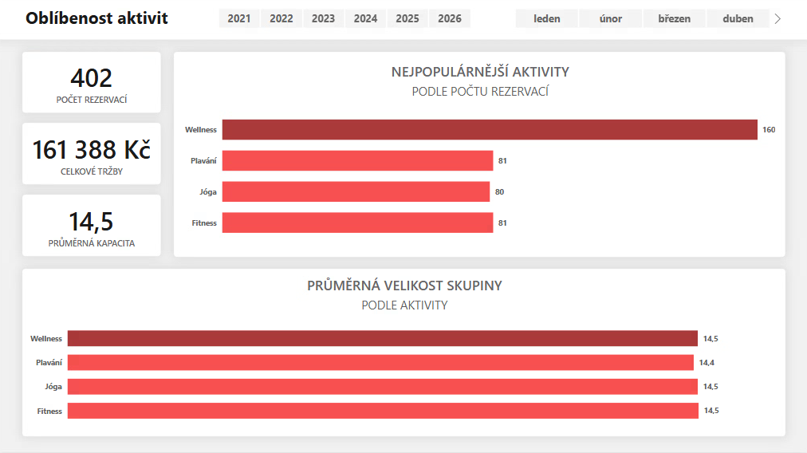
---
- **NEJPOPULÁRNĚJŠÍ AKTIVITY PODLE POČTU REZERVACÍ**
  - **Typ:** Clustered bar chart
  - **Popis:** Vizuál porovnává aktivity na základě absolutního počtu rezervací.
  - **Odpovídá na otázku:** Jaké typy aktivit jsou nejpopulárnější?

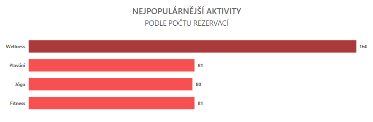
---
- **PRŮMĚRNÁ VELIKOST SKUPINY PODLE AKTIVITY**
  - **Typ:** Clustered bar chart
  - **Popis:** Zobrazuje průměrnou kapacitu (účast) pro jednotlivé typy aktivit.
  - **Odpovídá na otázku:** Jaký je průměrný počet účastníků u různých typů aktivit?

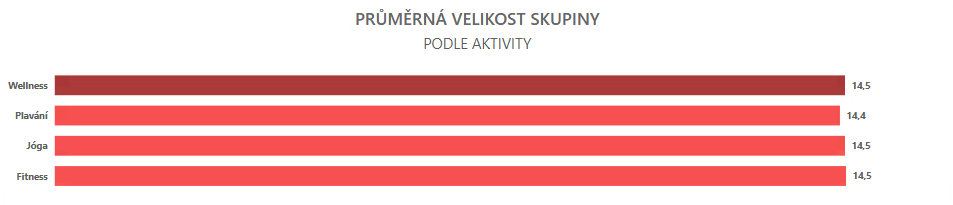
---

## **2. Analýza výkonnosti lokalit**

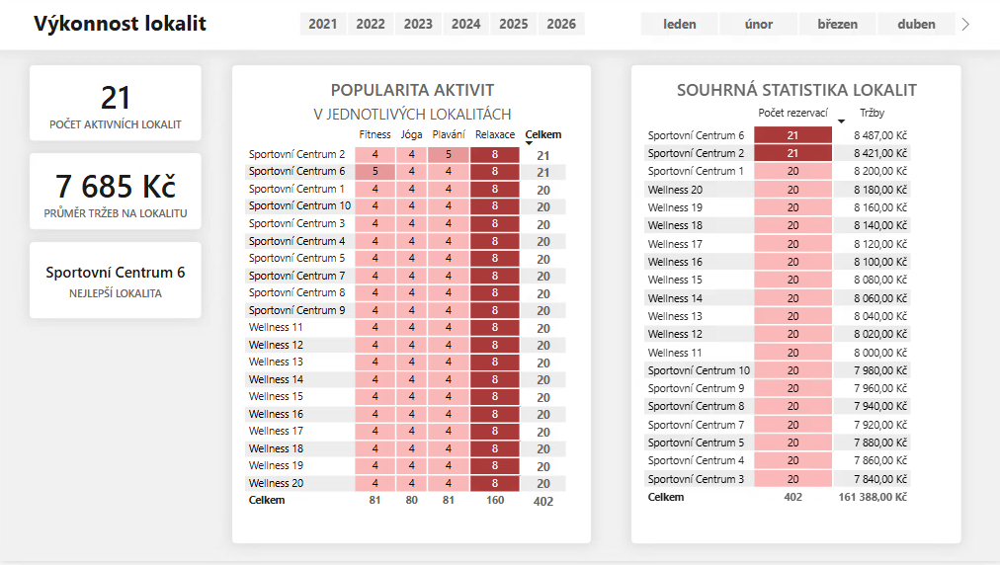
---

- **POPULARITA AKTIVIT V JEDNOTLIVÝCH LOKALITÁCH**
  - **Typ:** Matrix
  - **Popis:** Vizuál detailně rozpadá počty rezervací pro jednotlivé typy aktivit v rámci každé konkrétní pobočky.
  - **Odpovídá na otázku:** Popularita aktivit v jednotlivých lokalitách?

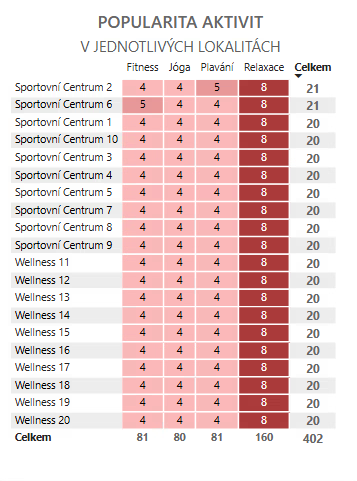
---

- **SOUHRNNÁ STATISTIKA LOKALIT**
  - **Typ:** Matrix
  - **Popis:** Seznam všech lokalit seřazený podle výkonnosti, který zobrazuje celkový počet rezervací a vygenerované tržby pro každou pobočku.
  - **Odpovídá na otázku:** Které lokality generují nejvíce rezervací? / Tržby podle lokalit.

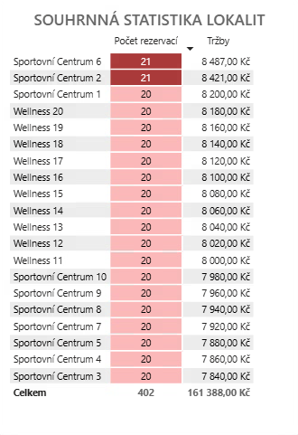
---

## **3. Segmentace zákazníků**

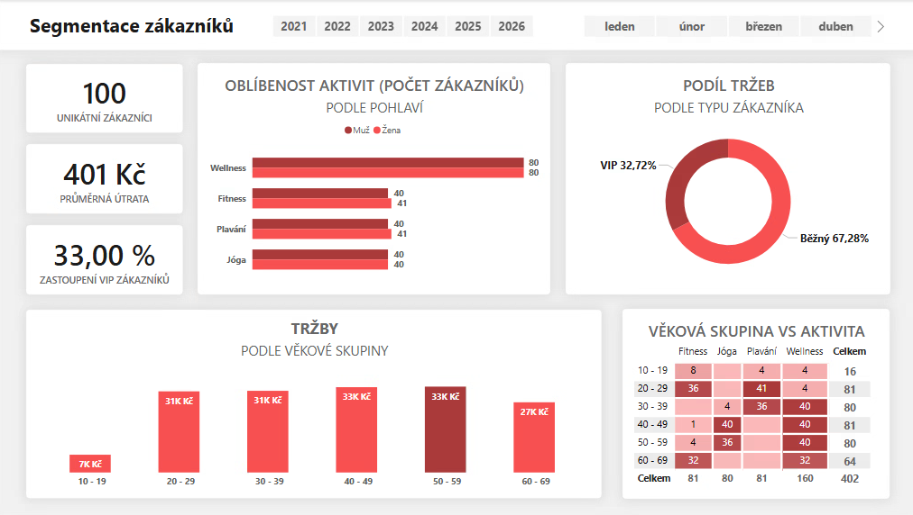
---

- **OBLÍBENOST AKTIVIT PODLE POHLAVÍ**
  - **Typ:** Clustered bar chart
  - **Popis:** Graf porovnává počet unikátních zákazníků v jednotlivých aktivitách rozdělený na muže a ženy.
  - **Odpovídá na otázku:** Je nějaký rozdíl v chování zákazníků podle pohlaví?

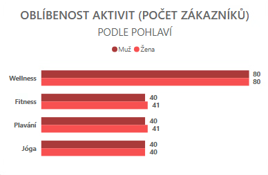
---

- **PODÍL TRŽEB PODLE TYPU ZÁKAZNÍKA**
  - **Typ:** Donut chart
  - **Popis:** Kruhový graf zobrazuje procentuální podíl tržeb generovaných VIP zákazníky oproti běžným zákazníkům.
  - **Odpovídá na otázku:** Jaké je chování VIP zákazníků? / Jaké skupiny zákazníků utrácejí nejvíce?

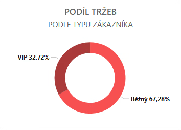
---

- **TRŽBY PODLE VĚKOVÉ SKUPINY**
  - **Typ:** Column chart
  - **Popis:** Sloupcový graf vizualizuje celkový objem tržeb pro jednotlivé věkové intervaly.
  - **Odpovídá na otázku:** Jaké skupiny zákazníků utrácejí nejvíce?

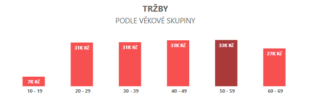
---

- **VĚKOVÁ SKUPINA VS AKTIVITA**
  - **Typ:** Matrix
  - **Popis:** Matice zobrazující preference aktivit v závislosti na věku účastníků.
  - **Odpovídá na otázku:** Které věkové skupiny preferují konkrétní typy aktivit?

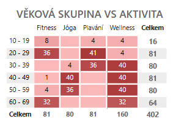
---

## **4. Sezónní analýza**

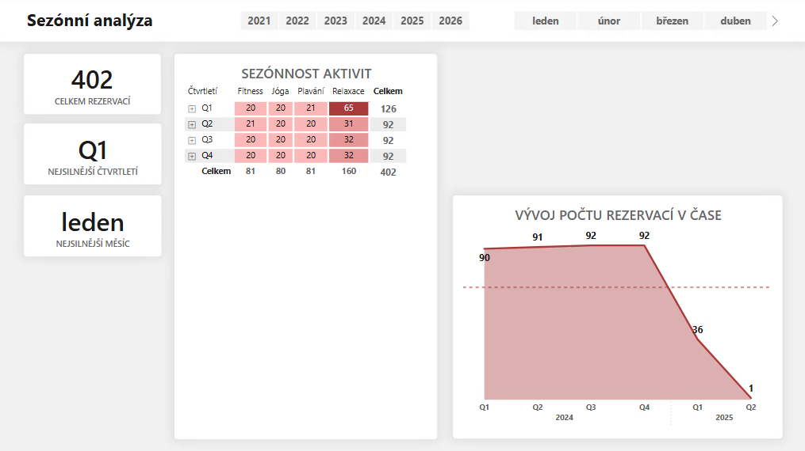
---

- **SEZÓNNOST AKTIVIT**
  - **Typ:** Matrix
  - **Popis:** Matice zobrazující počty rezervací pro jednotlivé typy aktivit v rámci čtvrtletí. Podmíněné formátování vizuálně zvýrazňuje období s nejvyšší poptávkou.
  - **Odpovídá na otázku:** Jaké aktivity jsou populární během jednotlivých měsíců?

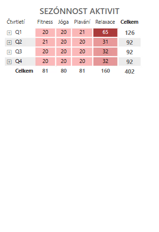
---

- **VÝVOJ POČTU REZERVACÍ V ČASE**
  - **Typ:** Area chart
  - **Popis:** Graf vizualizuje časovou řadu počtu rezervací, čímž ukazuje výkyvy v návštěvnosti a celkový trend v průběhu roku.
  - **Odpovídá na otázku:** Kdy je největší zájem o rezervace?

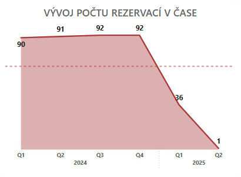
---

- **KARTY NEJSILNĚJŠÍCH OBDOBÍ (KPI)**
  - **Typ:** Card
  - **Popis:** Vizuály explicitně identifikují měsíc a čtvrtletí s historicky nejvyšším počtem rezervací.
  - **Odpovídá na otázku:** Kdy je největší zájem o rezervace?

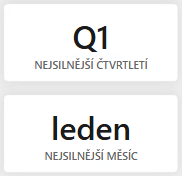
---

## **5. Analýza zrušených rezervací**

- **PODÍL ZRUŠENÝCH REZERVACÍ**
  - **Typ:** Donut chart (a KPI karta)
  - **Popis:** Kruhový graf vizualizuje poměr mezi zrušenými a potvrzenými rezervacemi. Karta vlevo potvrzuje celkovou míru zrušení.
  - **Odpovídá na otázku:** Jaké procento rezervací je zrušeno?

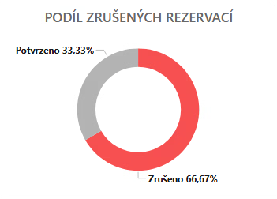

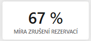
---

- **NEJVÍCE RUŠENÉ AKTIVITY**
  - **Typ:** Clustered bar chart
  - **Popis:** Graf porovnává absolutní počet zrušených rezervací pro jednotlivé typy aktivit (nejvíce storen vykazuje Relaxace - 106).
  - **Odpovídá na otázku:** Podíl zrušených rezervací podle aktivity.

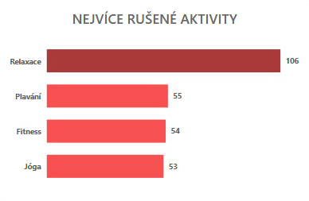
---

- **VÝVOJ POČTU ZRUŠENÝCH REZERVACÍ V ČASE**
  - **Typ:** Area chart
  - **Popis:** Zobrazuje časový trend počtu zrušených rezervací v jednotlivých čtvrtletích, což umožňuje sledovat výkyvy v chování zákazníků.
  - **Odpovídá na otázku:** Trendy zrušení rezervací v čase.

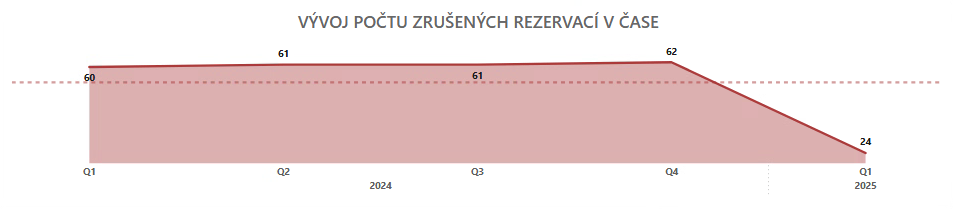
---

## **6. Finanční analýza**

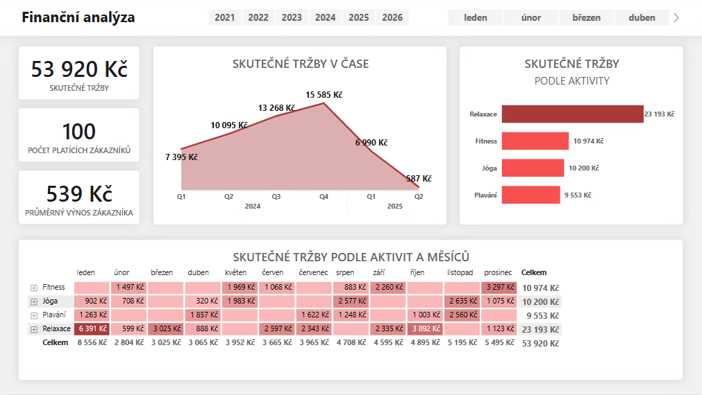

- **SKUTEČNÉ TRŽBY PODLE AKTIVIT A MĚSÍCŮ**
  - **Typ:** Matrix
  - **Popis:** Matice zobrazující tržby rozpadlé podle typu aktivity (řádky) a jednotlivých měsíců (sloupce).
  - **Odpovídá na otázku:** Jaké jsou tržby podle různých dimenzí (např. zákazníci, aktivity a to přes jednotlivé měsíce i celkově)?

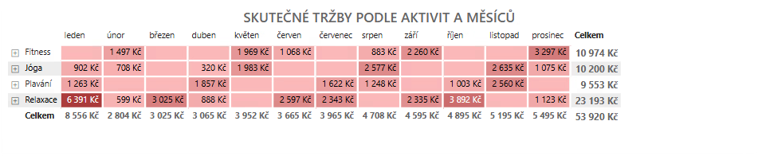

- **SKUTEČNÉ TRŽBY PODLE AKTIVITY**
  - **Typ:** Clustered bar chart
  - **Popis:** Pruhový graf porovnává celkový objem tržeb generovaný jednotlivými kategoriemi aktivit (nejvýnosnější je Relaxace).
  - **Odpovídá na otázku:** Jaké jsou tržby podle různých dimenzí?

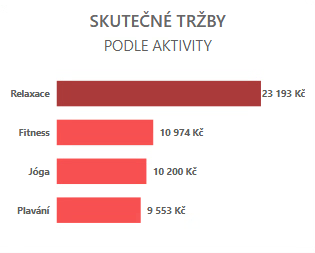

- **PRŮMĚRNÝ VÝNOS ZÁKAZNÍKA (KPI)**
  - **Typ:** Card
  - **Popis:** Vizuál zobrazuje klíčovou metriku průměrné útraty na jednoho platícího zákazníka.
  - **Odpovídá na otázku:** Jaký je průměrný výnos na zákazníka?

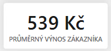
---
